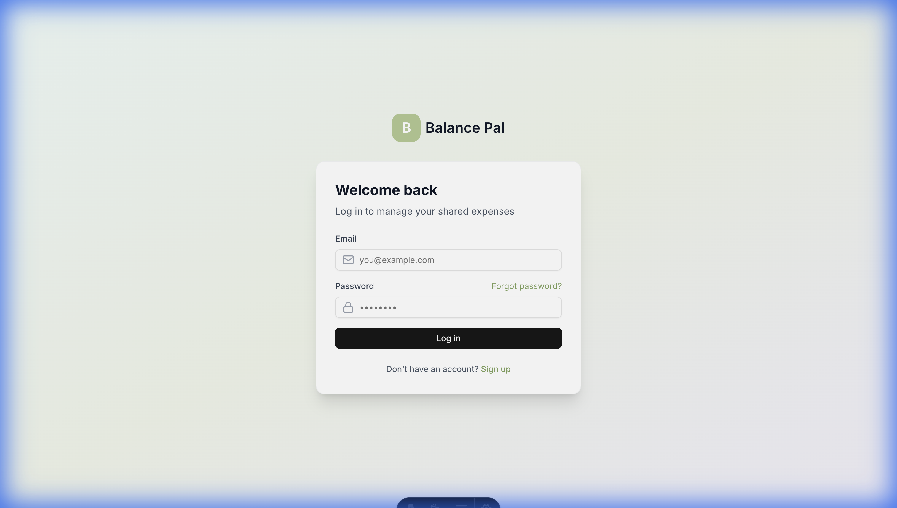
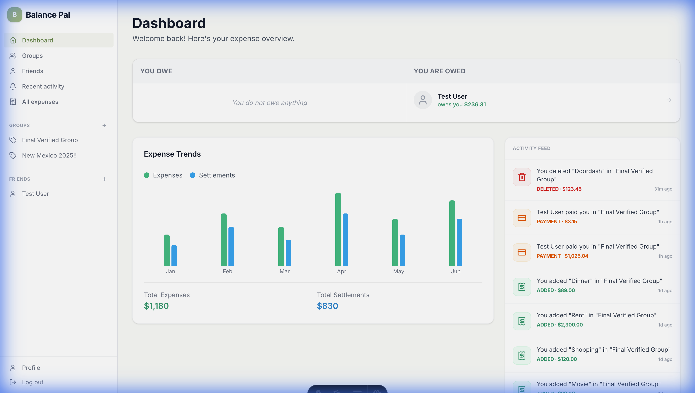
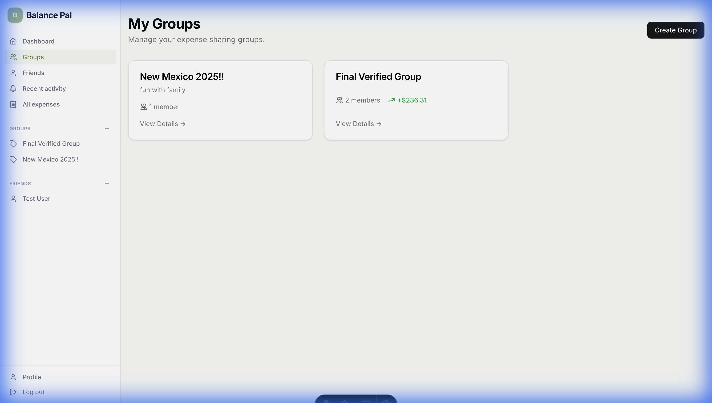
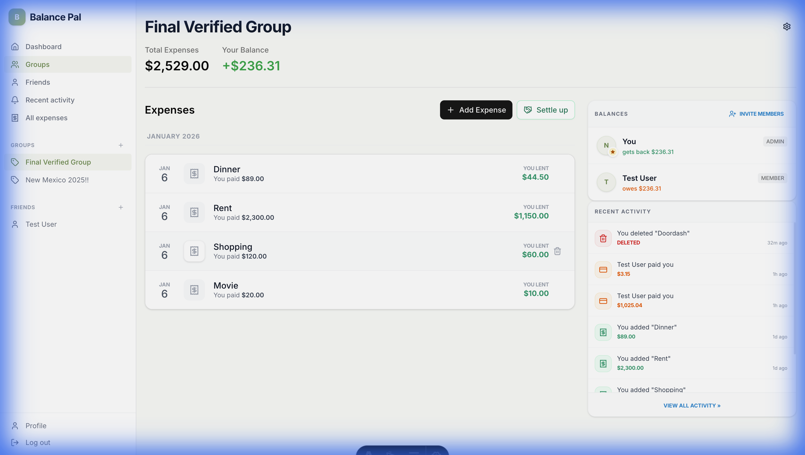

# Balance Pal

Balance Pal is a modern expense splitting application designed to make sharing costs with friends and family effortless. Built with a robust tech stack featuring Astro, Vue 3, and Tailwind CSS.

## Features

- **Dashboard**: Quick overview of your active groups and recent activity.
- **Group Management**: Create and manage expense groups easily.
- **Expense Tracking**: Add detailed expenses, split costs, and track balances.
- **Secure Authentication**: User-friendly login and registration flow.

## Screenshots

| Login | Dashboard |
|:---:|:---:|
|  |  |

| Groups List | Group Details |
|:---:|:---:|
|  |  |

## Tech Stack

This project uses a modern and performant stack:

- **Framework**: [Astro v5](https://astro.build) - The web framework for content-driven websites.
- **Frontend**: [Vue 3](https://vuejs.org/) - The progressive JavaScript framework.
- **Styling**: [Tailwind CSS v4](https://tailwindcss.com/) - A utility-first CSS framework.
- **State Management**: [Pinia](https://pinia.vuejs.org/) - The intuitive store for Vue.js.
- **Database**: PostgreSQL linked with [Drizzle ORM](https://orm.drizzle.team/) for type-safe database methodology.
- **Validation**: [Zod](https://zod.dev/) & [Vee-Validate](https://vee-validate.logaretm.com/).

## Getting Started

### Prerequisites

Ensure you have the following installed on your machine:
- **Node.js**: v18.0.0 or higher
- **pnpm** (recommended) or **npm**

### Installation

1. **Clone the repository:**
   ```bash
   git clone <repository-url>
   cd balancepal
   ```

2. **Install dependencies:**
   ```bash
   pnpm install
   # or
   npm install
   ```

3. **Environment Setup:**
   Copy the example environment file to create your local configuration.
   ```bash
   cp .env.example .env
   ```
   *Note: Open `.env` and fill in your Supabase credentials.*

4. **Initialize Database:**
   ```bash
   # Push schema to Supabase
   pnpm db:push
   
   # Seed demo user
   # Note: You need SUPABASE_SERVICE_ROLE_KEY in .env
   pnpm db:seed
   ```

### How to Run

Start the local development server:

```bash
pnpm dev
```

The application will be running at [http://localhost:4321](http://localhost:4321).

## Test Credentials

To verify the app features without creating a new user, you can use the following existing account:

- **Email**: `demo@balancepal.com`
- **Password**: `Demo@123`

---

## Commands Summary

| Command | Action |
| :--- | :--- |
| `pnpm dev` | Starts local dev server at `localhost:4321` |
| `pnpm build` | Build your production site to `./dist/` |
| `pnpm preview` | Preview your build locally |
| `pnpm db:push` | Push schema changes to the database |
| `pnpm lint` | Run ESLint to check code quality |
